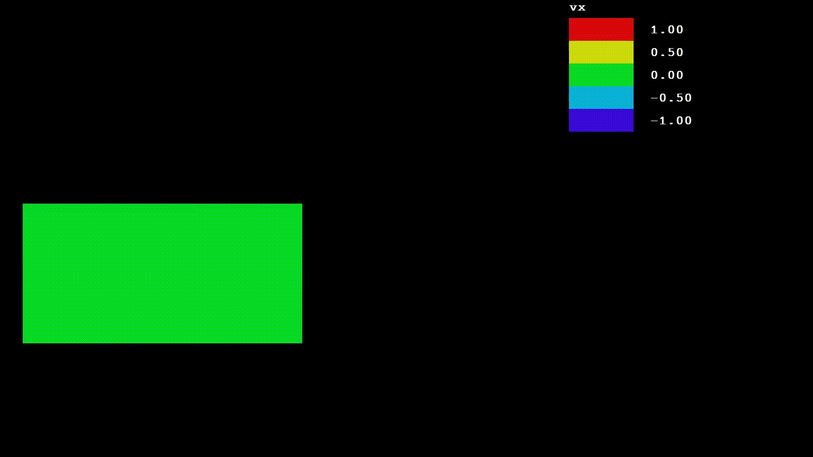
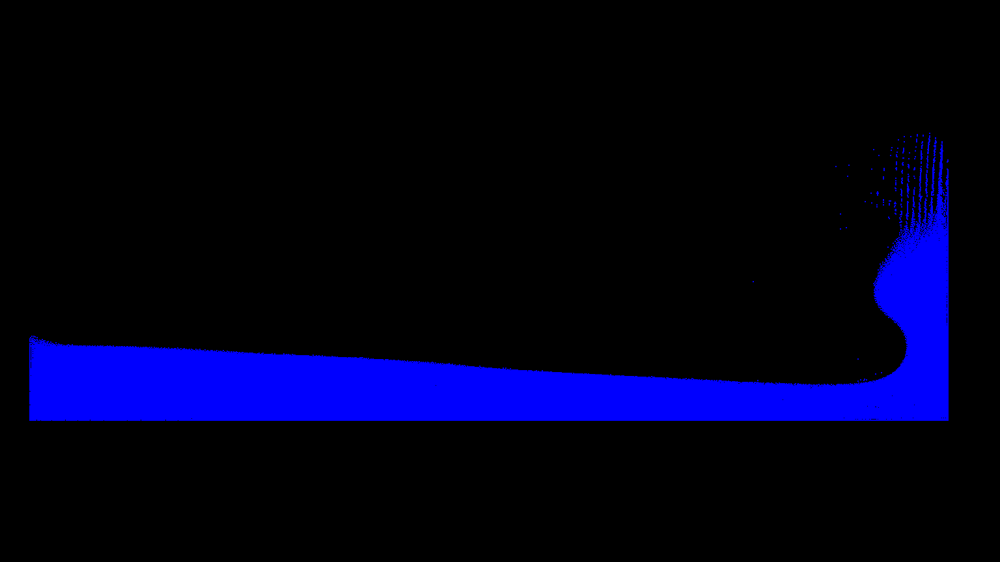
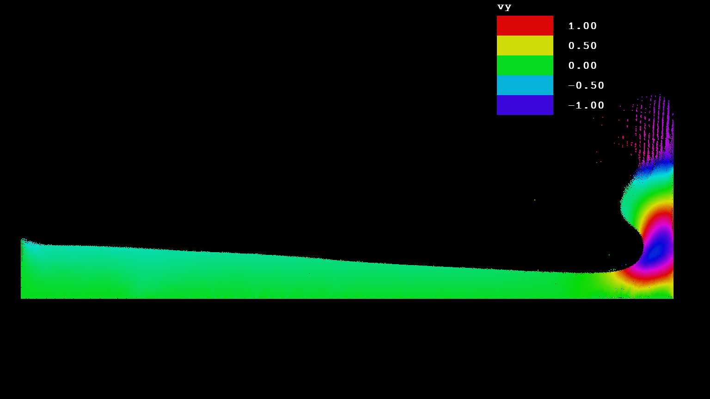
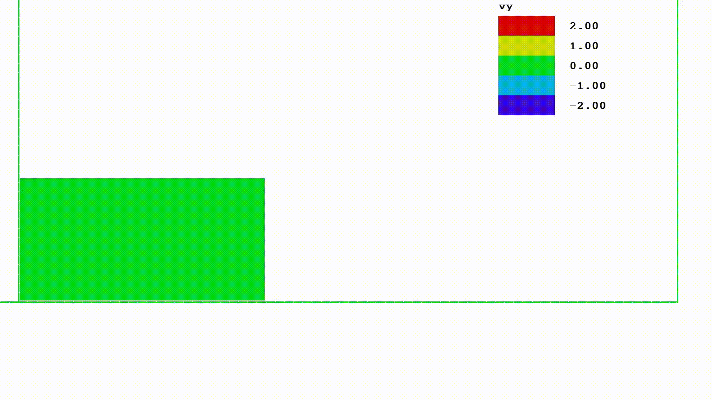

# SPH2D_Drawer
Visualization tool for my SPH2D project

It's based on parts of my first public c++ game [RAB_RTS_2](https://github.com/RackotRR/RAB_RTS_2). 
Graphics here is **SDL2** library.
In order to accelerate data reading I'm using **mio** library with **OpenMP**: there are a lot of data files, which are loaded in parallel using memory mapping.

Here is implemented heatmap, and you can choose which variable you need to see and its bounds. When heatmap is enabled, it also shows its legend.
You can place *heatmap_presets.txt* file in experiment directory, so you can use presets from there anytime.
The preset syntax is simple: `[preset_name] [variable_name] [min] [max]`.

The whole data is loaded into memory and you can navigate through time layers by keyboard: *A*/*D* for changing one layer per click, and *S*/*W* for changing layers while keys are pressed.
You can click *Space* to run/stop automatic layers changing. *Enter* click returns time layers iterator at the beggining.

You can move across current time layer by mouse or by *IJKL* keys.
*Z*/*X* click scales layer.

There's some helpful capture utils here:
Click by *C* takes a capture of rendered window and place it in *[experiment_name]/screenshots/* directory.

When you hold *V* program takes captures every time a layer changes. When you release the key, program creates a *[video_name].bat* file which can create a video by means of **FFMPEG**. You can change commands in there in order to tune your video. Next *V* press starts new series of capturs in different folder, and after that creates another *.bat* file and so on.

Partly the program can be controlled by console commands. For switching controll click *F1*.
Type `help` to see available commands.
The most common are: 
- `set [variable_name] [value]` (Sets new value for specified variable. You can see these variables by `set help`);
- `heatmap set` (Starts heatmap preset creation dialog);
- `heatmap preset` (Starts heatmap preset choosing from available presets in *heatmap_presets.txt*).
